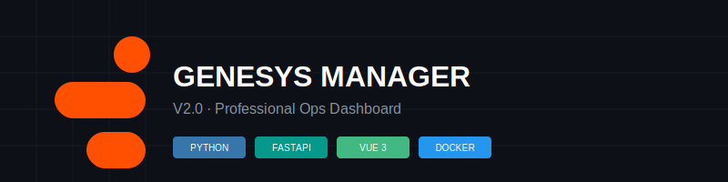

<div align="center">
  
</div>

# ⚡ Genesys Manager: Gestão Avançada Genesys Cloud

> Dashboard full-stack de alto desempenho para orquestração de usuários, filas e permissões na plataforma Genesys Cloud.


---

## 🎯 Explore o Projeto
- **🚀 Frontend:** [Vue 3 App](frontend/)
- **⚙️ Backend:** [FastAPI Core](backend/)
- **🔐 Segurança:** [Protocolo de Autenticação](backend/auth.py)
- **📦 Infraestrutura:** [Orquestração Docker](docker-compose.yml)

---

## 📌 Problema de Negócio

Originalmente um script manual no Google Colab, a gestão de usuários no Genesys Cloud era fragmentada e de difícil auditoria. O **Genesys Manager V2** centraliza essa operação em uma plataforma web segura, automatizando fluxos complexos de reativação e migração que antes levavam minutos em segundos.

## 🏗️ Arquitetura do Sistema

O sistema utiliza uma arquitetura de proxy reverso e túnel seguro para exposição global sem abertura de portas locais.

```mermaid
graph TD
    User((Usuário)) -->|HTTPS| CF[Cloudflare Tunnel]
    CF -->|Proxy| Nginx[NGINX Reverse Proxy]
    Nginx -->|/ (Static)| FE[Vue 3 SPA]
    Nginx -->|/api (Proxy)| BE[FastAPI Backend]
    BE -->|OAuth2| GC[Genesys Cloud API]
```

## 📊 Stack Tecnológica

### Core Services
| Tecnologia | Função | Vantagem |
| :--- | :--- | :--- |
| **Python / FastAPI** | API Backend | Performante, assíncrona e tipagem forte. |
| **Vue 3 / Vite** | Dashboard Frontend | Interface reativa e rápida com Composition API. |
| **Tailwind CSS 4** | Design System | Estilização moderna e layout responsivo. |
| **Docker Compose** | Infraestrutura | Reprodutibilidade total do ambiente produtivo. |

## 📁 Estrutura do Projeto

```text
├── backend/            # API Python (FastAPI, Auth, Routes)
├── frontend/           # Interface Vue 3 (Vite, Tailwind)
├── reports/            # Ativos visuais e documentação técnica
│   └── figures/        # Banners e diagramas
├── docker-compose.yml  # Orquestração de containers
└── .gitignore          # Proteção de envs e caches
```

## 🚀 Como Executar o Piloto

1.  **Clone o ambiente:** `git clone ...`
2.  **Configuração:** Siga o arquivo `backend/.env.example`.
3.  **Subida:** `docker-compose up -d --build`.
4.  **Acesso:** Disponível em `http://localhost:80`.

---
**Desenvolvido por Athos** - [GitHub](https://github.com/athosroque)
