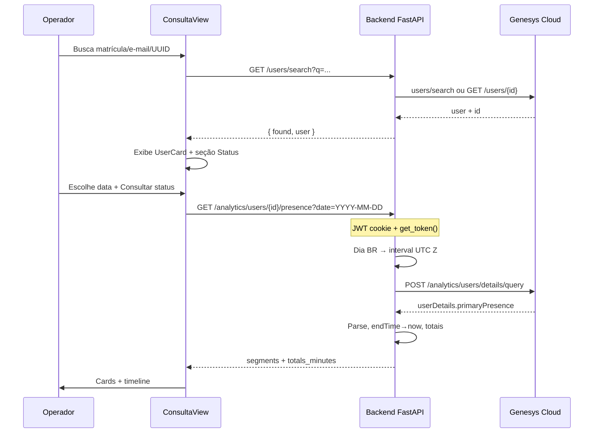

# Analytics de presença — integração na Consulta e Ações

> **Status:** implementado (MVP)  
> **Data:** 2026-08-05  
> **Página alvo:** `frontend/src/views/ConsultaView.vue`  
> **Fonte Genesys:** [User Status Detail query](https://developer.genesys.cloud/analyticsdatamanagement/analytics/detail/user-query.html)  
> **Código:** `backend/routes/analytics.py`, `backend/services/user_presence.py`, `frontend/src/components/PresencePanel.vue`

---

## 1. Objetivo da feature

Após buscar um usuário na página **Consulta e Ações**, oferecer uma opção adicional para **consultar o status (presença) do agente/cliente na plataforma Genesys Cloud em um dia de calendário** (fuso `America/Sao_Paulo`).

A feature deve:

1. Usar o `user.id` (UUID) já obtido pela busca existente.
2. Consultar o histórico de `primaryPresence` daquele dia via Analytics API.
3. Exibir totais por status (minutos) e uma timeline visual compreensível.
4. Manter OAuth Genesys **somente no backend** (mesmo padrão do restante do app).

Referência de lógica: script Colab independente (client credentials + intervalo do dia + parse de `primaryPresence` + gráfico). **Não copiar o Colab**; extrair apenas a lógica e adaptá-la aos padrões do genesys-manager.

---

## 2. Achados no código atual

### 2.1 Não existe módulo de analytics no repositório

Varredura em `backend/` e `frontend/`:

| Área | Situação |
| :--- | :--- |
| Rotas FastAPI | `users`, `queues`, `groups`, `roles`, `divisions`, `migration`, `audits`, `auth` — **sem** `analytics` |
| Serviços | `services/user_audit.py` (auditoria) — **sem** presença/analytics |
| Frontend API | `api/genesys.js`, `api/audits.js` — **sem** cliente de analytics |
| Dependências UI | Vue 3 + Tailwind; **sem** Plotly/Chart.js/ECharts |
| Docs | `docs/arquivo/` só material legado de auditoria/CLI — **sem** doc de analytics |

Conclusão: o “módulo novo de analytics” ainda **não está no código**. Esta documentação define como introduzi-lo de forma alinhada ao projeto.

### 2.2 Página Consulta e Ações (ponto de UI)

- Rota `/` → `ConsultaView.vue` (KeepAlive em `App.vue`).
- Fluxo atual: `SearchBar` → `searchUser(q)` → `UserCard` + seções **Ações Disponíveis** (reativar, remover grupo, migração).
- Filas carregadas em paralelo via `GET /users/{id}/queues`.
- O deep-link “Ver auditoria deste usuário” foi removido; a Trilha de Auditoria permanece em `/auditoria`. A nova opção de presença deve viver **na própria Consulta**, como seção/ação, sem navegar para outra página.

### 2.3 Autenticação Genesys (não reinventar no frontend)

| Camada | Mecanismo |
| :--- | :--- |
| App → operador | Magic link + JWT em cookie HttpOnly (`auth_local.get_current_user`) |
| Backend → Genesys | OAuth **client credentials** em `auth.get_token()` + header `h(token)` |
| Região | `GENESYS_REGION` default `sae1.pure.cloud` (`config.py` → `BASE_URL` / `AUTH_URL`) |
| Frontend | Só chama o backend via `api/http.js` (`credentials: 'include'`); **nunca** recebe client secret |

Qualquer chamada a `/api/v2/analytics/...` deve seguir o mesmo proxy: rota FastAPI autenticada localmente → `get_token()` → `httpx` para Genesys.

### 2.4 Padrões úteis para espelhar

- **Auditoria** (`routes/audits.py`): docstring com permissão Genesys, retry em 429 (`Retry-After`), schemas Pydantic, erros 403 com mensagem acionável.
- **Users** (`routes/users.py`): sanitiza UUID (`strip("{}")`), resposta enxuta para o frontend.
- **Timezone no frontend (auditoria):** `utils/datetimeLocal.js` trata datetime-local do browser. Para presença do **dia civil BR**, o intervalo deve ser calculado no **backend** com `America/Sao_Paulo` (como no Colab), não depender do fuso do browser do operador.

---

## 3. Fonte da verdade (Genesys Cloud)

### 3.1 Endpoint

```http
POST https://api.{REGION}/api/v2/analytics/users/details/query
```

Documentação oficial: [User Status Detail query](https://developer.genesys.cloud/analyticsdatamanagement/analytics/detail/user-query.html).

Retorna, por usuário, mudanças de:

- **`primaryPresence`** — presença de sistema (`systemPresence`) + opcionalmente `organizationPresenceId` (presença secundária da org).
- **`routingStatus`** — status ACD (ON_QUEUE, INTERACTING, IDLE, OFF_QUEUE, etc.).

Para a **primeira entrega** (paridade com o Colab): usar apenas `primaryPresence` / `systemPresence`.  
`routingStatus` fica como evolução (o título do Colab falava em “fila/interação”, mas o código Colab analisado só parseia `primaryPresence`).

### 3.2 Request mínimo (alinhado ao Colab)

```json
{
  "interval": "2026-08-05T03:00:00Z/2026-08-06T03:00:00Z",
  "userFilters": [
    {
      "type": "or",
      "predicates": [
        { "dimension": "userId", "value": "<UUID-DO-USUARIO>" }
      ]
    }
  ]
}
```

Notas da documentação:

- `interval` no formato ISO-8601 `start/end` (UTC).
- Filtros de usuário: dimensão **`userId` apenas**.
- Com filtros, intervalo máximo **31 dias**; sem filtros, **7 dias**. Um dia civil é seguro.
- Endpoint **síncrono** (`/query`): pensado para dados recentes e resposta imediata; timeout típico da família Analytics síncrona ~**10s**. Para histórico em massa, Genesys recomenda `/api/v2/analytics/users/details/jobs` (fora do escopo da Consulta).
- Intervalo de início histórico: até ~**558 dias** no passado (anúncio Genesys sobre este endpoint). Ainda assim, a UI da Consulta deve restringir a **1 dia** por consulta.

### 3.3 Response (trecho relevante)

```json
{
  "userDetails": [
    {
      "userId": "...",
      "primaryPresence": [
        {
          "startTime": "2026-08-05T12:00:12.354Z",
          "endTime": "2026-08-05T14:20:28.936Z",
          "systemPresence": "AVAILABLE",
          "organizationPresenceId": "6a3af858-942f-489d-9700-5f9bcdcdae9b"
        }
      ],
      "routingStatus": [ /* opcional / fase 2 */ ]
    }
  ]
}
```

Regras de parse (Colab → produto):

| Campo | Regra |
| :--- | :--- |
| `startTime` | Obrigatório; ignorar segmento sem start |
| `endTime` | Se **ausente**, o agente ainda está naquele status → usar **agora (UTC)** |
| `systemPresence` | Status exibido (AVAILABLE, OFFLINE, BUSY, AWAY, BREAK, …) |
| Duração | `(end − start)` em minutos (2 casas, como no Colab) |
| Exibição | Converter start/end para `America/Sao_Paulo` na timeline |

### 3.4 Escopos OAuth e permissões

| Tipo | Valor esperado | Fonte |
| :--- | :--- | :--- |
| OAuth scope (client) | `analytics:readonly` | [OAuth Scopes](https://developer.genesys.cloud/authorization/platform-auth/scopes) — o próprio doc cita `POST /api/v2/analytics/users/details/query` como exemplo de POST somente leitura |
| Permissão de role (integração) | Tipicamente ligada a analytics / user detail (ex. `analytics:userDetail` em materiais de implantação). **Validar no API Explorer** da org (`Permissions and Scopes` do recurso) antes de ir a produção | API Explorer + admin da org |
| Divisões (FGAC) | Client credentials herdam grants da role da integração; sem divisão correta o resultado pode vir **vazio** mesmo com scope ok | [Fine-Grained Access Control](https://developer.genesys.cloud/authorization/platform-auth/fgac) |

Ação operacional (pré-implementação): no Admin Genesys, garantir que o OAuth Client usado por `GENESYS_CLIENT_ID` tenha scope `analytics:readonly` e role com permissão de user detail analytics nas divisões necessárias.

### 3.5 Rate limits e resiliência

- Resposta **429** + header `Retry-After` (segundos): ver [Rate Limits](https://developer.genesys.cloud/api/rest/rate_limits.html).
- Referência comunitária frequente para client credentials: ordem de grandeza **~300 req/min por token** e teto agregado por client — tratar como orientação, não SLA fixo.
- Reutilizar o padrão de retry de `routes/audits.py` (`genesys_request` com backoff em 429).
- Analytics síncrono: evitar fan-out; **1 usuário × 1 dia** por clique é o modelo correto para a Consulta.

### 3.6 Timezone Brasil

Dia civil em `America/Sao_Paulo`:

1. `date = YYYY-MM-DD`
2. `local_start = 00:00:00` nesse fuso  
3. `local_end = local_start + 1 day`
4. Converter ambos para UTC e formatar com sufixo `Z` (sem offset numérico), ex.:  
   `2026-08-05T03:00:00Z/2026-08-06T03:00:00Z` (horário de Brasília −03, sujeito a regras oficiais do fuso; usar `zoneinfo` / IANA, não offset fixo hardcoded).

Python 3.11+: preferir `zoneinfo.ZoneInfo("America/Sao_Paulo")` (stdlib).

---

## 4. Endpoint interno proposto

Espelha o estilo do projeto (proxy fino, JWT local, token Genesys no servidor).

### 4.1 Rota

```http
GET /analytics/users/{user_id}/presence?date=YYYY-MM-DD
```

Alternativa aceitável (mais próxima de audits):

```http
POST /analytics/presence
Content-Type: application/json

{ "user_id": "...", "date": "YYYY-MM-DD" }
```

**Recomendação:** `GET` com query `date` — leitura idempotente, encaixa no fluxo da Consulta após ter o UUID.

- Auth: `Depends(get_current_user)`
- Router novo: `backend/routes/analytics.py` registrado em `main.py` com `prefix="/analytics"`
- Genesys: `POST {BASE_URL}/analytics/users/details/query`

### 4.2 Request (contrato interno)

| Campo | Tipo | Obrigatório | Descrição |
| :--- | :--- | :--- | :--- |
| `user_id` | path UUID | sim | UUID Genesys (sanitizar `{}`) |
| `date` | query `YYYY-MM-DD` | sim | Dia civil em America/Sao_Paulo |

Validações:

- Data inválida → **422**
- Data futura → **422** (ou clamp para “hoje” BR — preferir 422 explícito)
- Data > ~558 dias no passado → **422** com mensagem clara

### 4.3 Response (contrato interno sugerido)

O backend **normaliza** a resposta Genesys (não vazar payload bruto ao frontend), no espírito de `/users/{id}/queues`.

```json
{
  "user_id": "00403044-6669-4c41-bc1e-f1dd8f2ee61e",
  "date": "2026-08-05",
  "timezone": "America/Sao_Paulo",
  "interval": "2026-08-05T03:00:00Z/2026-08-06T03:00:00Z",
  "queried_at": "2026-08-05T18:30:00Z",
  "open_segment": true,
  "segments": [
    {
      "system_presence": "AVAILABLE",
      "start": "2026-08-05T09:00:12-03:00",
      "end": "2026-08-05T11:20:28-03:00",
      "start_utc": "2026-08-05T12:00:12.354Z",
      "end_utc": "2026-08-05T14:20:28.936Z",
      "duration_minutes": 140.27,
      "organization_presence_id": "6a3af858-942f-489d-9700-5f9bcdcdae9b",
      "is_open": false
    }
  ],
  "totals_minutes": {
    "AVAILABLE": 140.27,
    "OFFLINE": 480.0,
    "BUSY": 35.5,
    "AWAY": 0,
    "BREAK": 15.0
  },
  "total_tracked_minutes": 670.77
}
```

| Campo | Significado |
| :--- | :--- |
| `open_segment` | Houve ao menos um segmento sem `endTime` (status ainda ativo) |
| `is_open` | Este segmento usou “agora” como fim |
| `totals_minutes` | Soma por `systemPresence` (chaves conhecidas + quaisquer outras retornadas) |
| `segments` | Ordenados por `start_utc` asc |

Erros:

| HTTP | Quando |
| :--- | :--- |
| 403 | Integração sem scope/permissão analytics — mensagem no estilo audits |
| 404 / found vazio | Genesys 200 sem `userDetails` / sem `primaryPresence` → `{ segments: [], totals_minutes: {}, ... }` com flag opcional `empty: true` (não confundir com usuário inexistente; o usuário já foi achado na Consulta) |
| 429 | Após esgotar retries → propagar com detalhe |
| 502 | Falha de token Genesys (já tratado em `http.js`) |

---

## 5. Mapeamento Colab → genesys-manager

| Lógica Colab | Backend | Frontend |
| :--- | :--- | :--- |
| `REGION` / secrets | `config.GENESYS_REGION` + `.env` (`get_token`) | — |
| `get_token()` | `auth.get_token()` existente | — |
| `get_day_interval_iso(date)` | helper em `services/user_presence.py` (ou no router) com `zoneinfo` | input `<input type="date">` envia só `YYYY-MM-DD` |
| `fetch_presence_data` | `POST .../analytics/users/details/query` | `api/genesys.js` → `getUserPresence(userId, date)` |
| `parse_presence_to_df` | normalização → `segments` + `totals_minutes` | consome JSON tipado |
| `endTime` ausente → now | no parse do backend (`is_open`) | badge “status atual” |
| Plotly `px.timeline` | — | timeline CSS ou lib leve (ver §6); **não** embutir Colab/Plotly por default |
| `color_map` | constante compartilhada ou espelho no front | mesmas cores |

---

## 6. UI proposta na Consulta e Ações

Inserir **após o `UserCard` e antes (ou dentro) de “Ações Disponíveis”**, como seção própria — leitura, não ação destrutiva.

### 6.1 Wireframe textual

```
[ UserCard … ]

┌─ Status na plataforma ─────────────────────────────────────┐
│  Presença do dia (Genesys Analytics)                       │
│                                                            │
│  Data: [ 2026-08-05 ▾ ]   [ Consultar status ]             │
│                                                            │
│  ┌──────────┐ ┌──────────┐ ┌──────────┐ ┌──────────┐       │
│  │ AVAILABLE│ │  BUSY    │ │  AWAY    │ │ OFFLINE  │ …     │
│  │  2h 20m  │ │  35m     │ │  0m      │ │  8h 00m  │       │
│  └──────────┘ └──────────┘ └──────────┘ └──────────┘       │
│                                                            │
│  Timeline (00:00 → 24:00, America/Sao_Paulo)               │
│  ████░░░░███▓▓▓░░░░████████████░░░░░░  (faixa contínua)    │
│  ou faixas por status (stacked / Gantt simples)            │
│                                                            │
│  Lista opcional (colapsável):                              │
│  09:00–11:20  AVAILABLE   140 min                          │
│  11:20–11:55  BUSY         35 min                          │
│  …                                                         │
└────────────────────────────────────────────────────────────┘

┌─ Ações Disponíveis ────────────────────────────────────────┐
│  … reativar / grupos / migração …                          │
└────────────────────────────────────────────────────────────┘
```

### 6.2 Comportamento UX

1. Seção só aparece quando há `user` carregado.
2. Data default: **hoje** (calendário BR — idealmente o backend pode devolver `today` no health/config, ou o front assume data local; preferível default = data de hoje no fuso BR via backend opcional, ou documentar que o operador escolhe o dia).
3. Clique em **Consultar status** → loading na seção → toasts em erro (padrão `useToast`).
4. Nova busca de usuário limpa resultado de presença (como já limpa `migrationSteps`).
5. Segmento aberto (`is_open`): indicar visualmente “até agora”.
6. Status sem cor mapeada: cinza neutro + label crua.

### 6.3 Cores (paridade Colab)

| `systemPresence` | Cor | Hex Colab |
| :--- | :--- | :--- |
| AVAILABLE | verde | `#2ecc71` |
| OFFLINE | cinza | `#95a5a6` |
| BUSY | vermelho | `#e74c3c` |
| AWAY | amarelo | `#f1c40f` |
| BREAK | laranja | `#e67e22` |

### 6.4 Visualização — recomendação de implementação

O frontend hoje **não** tem biblioteca de gráficos. Ordem sugerida:

1. **MVP:** barra horizontal única (proporção do dia) + cards de totais + tabela de segmentos (CSS/Tailwind) — zero dependência nova.
2. **Opcional:** stacked bar / timeline com lib leve se o MVP ficar insuficiente.
3. **Evitar** Plotly só por paridade com Colab (peso alto para SPA atual).

Componente sugerido: `frontend/src/components/PresencePanel.vue` usado por `ConsultaView.vue`.

---

## 7. Fluxo ponta a ponta



---

## 8. Escopos, credenciais e restrições (checklist operacional)

- [ ] OAuth Client (`GENESYS_CLIENT_ID`) com scope **`analytics:readonly`** *(configuração na org — não versionada)*
- [ ] Role da integração com permissão de analytics user detail (validar no API Explorer da org)
- [ ] Grants de **divisão** suficientes (FGAC) — senão: resposta vazia silenciosa
- [x] Credenciais só em `.env` / secrets do Compose — nunca no frontend
- [x] Intervalo sempre **1 dia civil BR** → UTC com `Z`
- [x] Tratar `endTime` ausente
- [x] Retry em 429 (padrão audits)
- [x] Timeout httpx adequado (≥10–30s) para analytics síncrono
- [x] Não expor token Genesys ao browser

---

## 9. Fora de escopo (não implementar nesta feature)

- Página/menu lateral dedicado só de analytics
- Gráficos Plotly / export CSV / Excel
- Agregados (`/analytics/users/aggregates/query`) e presença secundária nomeada (`organizationPresenceId` → `presencedefinitions`)
- Timeline de **`routingStatus`** (fila / interação ACD) — evolução natural, mas não era o parse do Colab
- Jobs assíncronos (`/analytics/users/details/jobs`) e export em massa
- Webhooks / Notification Service de presença em tempo real
- Consulta multi-usuário ou intervalo multi-dia na UI
- Alterar `CLAUDE.md` do root do portfólio
- Commit nesta fase de documentação

---

## 10. Checklist de implementação

### Backend

1. [x] Criar `backend/routes/analytics.py` + registrar em `main.py`.
2. [x] Criar helper `interval_for_br_date(date: date) -> str` (teste unitário cobrindo offset −03).
3. [x] Criar `parse_primary_presence(payload, now=...)` → segments + totals (testes com fixture, incluindo sem `endTime`).
4. [x] Endpoint `GET /analytics/users/{user_id}/presence?date=...` com `get_current_user`, `get_token`, retry 429, 403 amigável.
5. [x] Testes em `backend/test_analytics.py` (mock `httpx`).
6. [ ] Validar em staging com o client real: um UUID conhecido + dia com atividade.

### Frontend

1. [x] `getUserPresence(userId, date)` em `frontend/src/api/genesys.js`.
2. [x] Componente `PresencePanel.vue` (date input, botão, loading, cards, timeline CSS, lista).
3. [x] Integrar em `ConsultaView.vue` após `UserCard`; limpar estado em nova busca.
4. [x] Mapa de cores + fallback; toast de erro via `useToast`.
5. [x] Teste Vitest de `presenceFormat.js` (formatação de minutos / cores / timeline).

### Operacional

1. [ ] Confirmar scopes/permissões no OAuth Client da org `sae1.pure.cloud` (`analytics:readonly` + FGAC).
2. [x] Atualizar `README.md` (seção funcionalidades) e `backend/README.md` (registry).
3. [ ] Se o debugging de scopes/timezone/429 passar de ~30 min, registrar em `LESSONS.md` do projeto (tags sugeridas: `genesys-analytics`, `rate-limit`, `timezone`).

---

## 11. Referências

| Recurso | URL |
| :--- | :--- |
| User Status Detail query | https://developer.genesys.cloud/analyticsdatamanagement/analytics/detail/user-query.html |
| Analytics Integration Guide | https://developer.genesys.cloud/analyticsdatamanagement/analytics/integration-guide |
| OAuth Scopes | https://developer.genesys.cloud/authorization/platform-auth/scopes |
| Rate Limits | https://developer.genesys.cloud/api/rest/rate_limits.html |
| FGAC / analytics | https://developer.genesys.cloud/authorization/platform-auth/fgac |
| Auth Genesys (projeto) | `backend/auth.py`, `backend/config.py` |
| UI Consulta | `frontend/src/views/ConsultaView.vue` |
| Padrão proxy + 429 | `backend/routes/audits.py` |

---

*MVP de presença implementado conforme este documento. Itens fora de escopo (§9) permanecem de fora; gap operacional principal: confirmar `analytics:readonly` no OAuth Client da org.*
